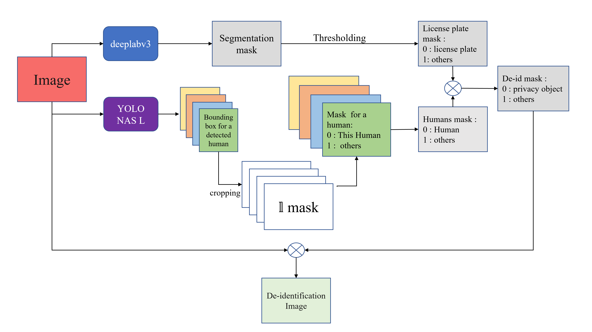

# 資料去識別化

使用預訓練之深度學習模型偵測圖片內的敏感個資並塗黑

## 使用之模型
- 車牌偵測 : Deeplabv3
    - 預訓練的二元語意分割模型 __deeplabv3__ 
    - 預訓練模型權重下載 : https://github.com/dbpprt/pytorch-licenseplate-segmentation

- 人物偵測: YOLO NAS L
  -  預訓練的物件偵測模型 __YOLO NAS L__
  -  [super_gradient](https://docs.deci.ai/index.html)


# De-identify the dataset of frames from the road surveillance camera.

Using pretrained deep learning model to de-identify all from the road surveillance camera.


## Environment:
### Language
python
- Third-party packages
  - pyyaml
  - tqdm 
  - numpy
  - torch, torchvision
  - ultralytics
  - super_gradients (for yolo_nas model)
  - opencv-python

## Model 
- license plate de-identification : 
  - A pretrained deeplabv3 binary __semantic segmentation__ model
  - Go to https://github.com/dbpprt/pytorch-licenseplate-segmentation ```Pretrained models``` to download its pretrained model
  - set the path of it at ```./config```:
    - license_plate_model: modelpath
- human de-identification: 
  - Object detection model __YOLO NAS L__ from [super_gradient](https://docs.deci.ai/index.html)
  - Using package ```super_gradients.training.models``` API to load
  - set the yolo nas model type at ```./config```:
    - yolo_nas: """yolo_nas_{TYPE}"""


## Execution:
- ```python ./deidentification.py --config your_config_file_path```
  - eg: ```python ./deidentification.py --config ./config.yml```
- config: YAML file type :


    srcroot  : root of your frames, have to pass need to give ```/```(linux, ```//``` for windows) in the end

    dstroot  : saving root, code will build a whole file tree mirrorring from 
            srcroot under dstroot

    device   : your device # e.g: cuda:0

    batchsize: batch size 

    bufsize  : Number of batches to be stored at once.

    license_plate_model:

    modelpath : The local path you save for the model downloaded from  
                https://github.com/dbpprt/pytorch-licenseplate-segmentation 

    threshold : binary segmentation threshold, 0.1 for 
                https://github.com/dbpprt/pytorch-licenseplate-segmentation 

    yolo_nas : yolo nas type # e.g. yolo_nas_l

## Pipeline:


